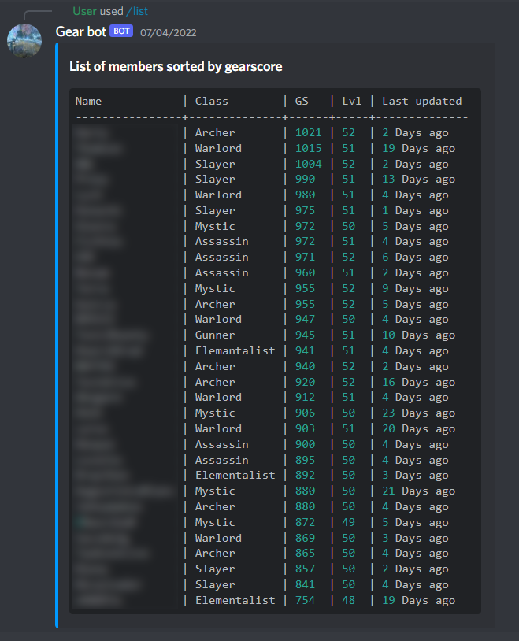
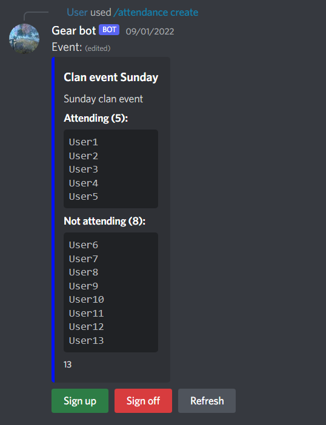

### Available commands:
- **/add** &larr; _Used to add your gear to the bot_
 ├- gear 
    ├- url
    └- attachment
- **/update** &larr; _Used to update your own statistics_
    ├- level
    ├- gearscore
    ├- name
    └- class
- **/average** &larr; _Shows guild averages_
    ├- level
    └- gearscore
- **/list (class)** &larr; _Lists everyone sorted by their gearscore, you can also specify to only show certain classes_
- **/classes** &larr; _Lists all classes and how many of them are in the guild_
- **/inspect (user)** &larr; _Show a gear card of a specific user_
- **/help** &larr; _List of commands_
- **/export | admin req** &larr; _Used to export a .csv of everyones statistics_
- **/events | admin req** &larr; _Lists people attending/missing from discord events_
     ├- attending
     └- missing
- **/delete | admin** req &larr; _used to delete users_
- **/attendance | admin req** &larr; _Commands for attendance events_
     ├- create (name) (description) (unique id)
     ├- attending (id)
     ├- signedoff (id)
     ├- missing (id)
     └- delete (id) // id is optional, leaving it out deletes all events
- **/remind | admin req** &larr; _Used to send out reminder DM's_
     ├- remind all (attendance event id) // sends out reminders to people who haven't marked their attendance
     └- remind user (member) (attendance event id)

### Gear list

### Attendance event
